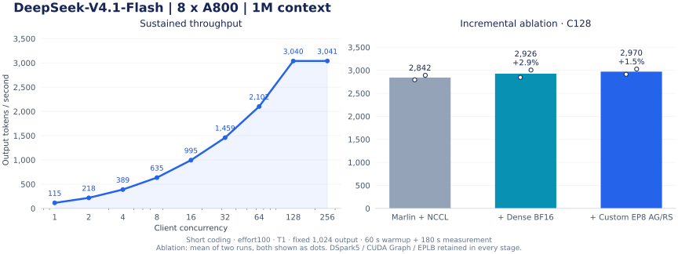

# DeepSeek-V4.1-Flash · Ampere Turbo for A100/A800

面向长上下文 coding agent 的 **DeepSeek V4.1 Flash A100/A800 SM80** 部署方案。实测硬件为**单机 8×A800-SXM4-80GB**，基于 [vLLM backport](https://github.com/wtdcode/vllm-backport/tree/master-v013)。

本文的端到端数据来自 A800；A100 使用同一 SM80 路径，但尚未在 A100 上独立复测。

Also searchable as **DeepSeek-V4.1-Flash**, **DeepSeek V4.1 Flash**, and **DeepSeek V4.1 Flash A100/A800 deployment**.

This is a reproducible **DeepSeek V4.1 Flash inference server for NVIDIA A100 and A800 (Ampere SM80)**. It documents vLLM backport deployment, FP4 Marlin experts, DSpark speculative decoding, CUDA Graphs, sparse MLA, prefix caching, and coding-agent benchmarks on eight 80 GB GPUs.

[测试方法](benchmarks/README.md) · [优化补丁](patches/manifest.json) · [评测详情](docs/agent-evaluation.md)

## 推理速度

单机持续吞吐，包含 reasoning token。短 coding 输入 78–90 token，effort100、temperature1、固定输出 1,024 token；每档预热 60 秒，测量完整 180 秒。C 表示客户端并发数。

<!-- CONCURRENCY_TABLE -->
| 并发 C | 输出吞吐（tokens/s） |
|---:|---:|
| 1 | **115.01** |
| 2 | **217.93** |
| 4 | **389.32** |
| 8 | **635.42** |
| 16 | **995.44** |
| 32 | **1,459.17** |
| 64 | **2,102.14** |
| 128 | **3,039.88** |
| 256 | **3,040.71** |
<!-- /CONCURRENCY_TABLE -->

此负载下 C128 已基本饱和，C256 主要增加排队。



[完整曲线复现](benchmarks/run_sweep.py) · [测试输入](benchmarks/data/short-coding-effort100.json.gz) · [结果校验](benchmarks/evidence-manifest.json)

真实长历史持续回放（1M 配置）：C128 两次为 **1,918.16 / 1,972.81 tokens/s**。输入 20,593–73,688 token、自然 EOS、完整计时 600 秒；回放已有工具结果。[长请求与社区优化实测](docs/round16-optimization.zh-CN.md)

## 优化与消融

保留 Marlin、DSpark5、CUDA Graph、FP8 KV 和 EPLB，在同一台机器、同一组 C128 请求上，逐步加入 dense BF16 分派和 EP8 通信优化。每档重复两次，报告均值及相对上一档的变化。

<!-- ABLATION_TABLE -->
| 配置 | 吞吐均值（tokens/s） | 相对上一档 |
|---|---:|---:|
| 基础：Marlin dense + NCCL EP8 | **2,842.48** | — |
| + dense BF16 分派（≥32 行） | **2,926.08** | +2.94% |
| + custom EP8 AG/RS | **2,970.50** | +1.52% |
<!-- /ABLATION_TABLE -->

dense BF16 在加载时准备稠密权重，较大 batch 直接调用 BF16 GEMM；EP8 对满足条件的等长 BF16 消息启用 custom AllGather/ReduceScatter。

其他补丁包括 SM80 candidate-only MQA、稀疏 attention tile 调优、DSpark 草稿 EPLB 隔离，以及 DSML 流式工具调用修复。未单独测得整模收益的补丁不标注加速百分比。[消融明细](docs/concurrency-and-short-requests.zh-CN.md)

## Agent 与问答评测

| 测试 | 分数 | 口径 |
|---|---:|---|
| SWE-bench Verified | **87.0%**（87/100） | effort75；seed42 固定子集；环境复评后 |
| DeepSWE | **67.26%**（76/113） | effort75，512K；包含中断恢复 |
| GPQA Diamond | **88.89%**（176/198） | Pass@1，effort100 |
| GSM8K | **95.53%**（1,260/1,319） | 8-shot CoT，宽松提取 + 精确匹配 |

SWE-bench 的 87/100 是此前修复后完成的 100 题固定子集结果；独立的 effort100 全量 500 题收据为 406/500 原始、417/500 环境复评，详见[评测记录](docs/agent-evaluation.md)。

SWE500 实际处理过 345,995-token 输入，累计 29,964 模型轮、41,043 工具调用。[逐任务记录与评测协议](docs/agent-evaluation.md)

## 部署

**TP4×DP2 · EP8 · DSpark5 · CUDA Graph · FP4 Marlin · FP8 MLA KV · GPU 前缀缓存**

显存预算 **0.90**，上下文 **1M（1,048,576）**，chunk **8,192**。

```bash
git clone https://github.com/Tokha233/deepseek-v4.1-flash-a100-turbo.git
cd deepseek-v4.1-flash-a100-turbo
pip install -r requirements.txt
docker build -t deepseek-v41-sm80:local .
python launch.py /path/to/existing/DeepSeek-V4.1-Flash --port 8083
```

Dockerfile 自动校验并安装补丁，启动器挂载已有权重。[参数](config/serve.json) · [环境变量](config/environment.json) · [构建验收状态](docs/release-plan.zh-CN.md)

```bash
curl http://127.0.0.1:8083/v1/chat/completions \
  -H 'Content-Type: application/json' \
  -d '{"model":"deepseek-ai/DeepSeek-V4.1-Flash","messages":[{"role":"user","content":"Implement an LRU cache in Python."}],"max_tokens":4096,"chat_template_kwargs":{"thinking":true,"reasoning_effort":100}}'
```

[Apache-2.0](LICENSE) · [第三方声明](NOTICE)
