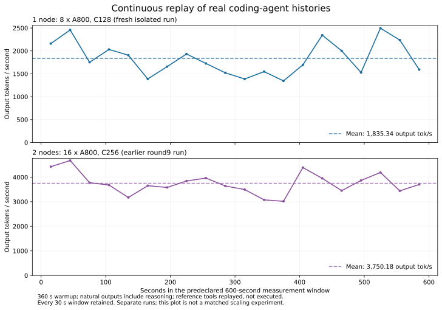

# DeepSeek-V4.1-Flash on Ampere

An SM80 deployment kit for long-context coding agents, built on [wtdcode/vllm-backport](https://github.com/wtdcode/vllm-backport/tree/master-v013). **Measured hardware: 8× NVIDIA A800-SXM4-80GB per node.** A100 is a portability target; the repository name does not imply an A100 measurement.

[中文说明与18个社区仓库对比](docs/community-comparison.zh-CN.md) · [Evaluation results](docs/agent-evaluation.md) · [Benchmark method](benchmarks/README.md) · [Release scope](docs/release-plan.zh-CN.md)

## What has been measured

| Evidence | Result | Scope |
|---|---:|---|
| Fresh isolated A800 node, C128 | **1,835.34 output tok/s** | Real-history continuous replay, fixed 600 s after 360 s warmup |
| Earlier other-node C128 | 1,923.33 output tok/s | Same replay protocol; one run |
| Earlier two-node C256 | 3,750.18 output tok/s | Two independent eight-GPU services, same fixed-window protocol |
| SWE-bench Verified 500 | **406/500, 81.2%** original | Complete tool execution and verification on the earlier runtime |
| Same SWE submissions after declared environment checks | 417/500, 83.4% | Environment-adjusted diagnostic, reported separately |
| Maximum observed SWE500 prompt | **345,995 tokens** | Actual tool history, not just a configured context ceiling |
| GPQA Diamond | 176/198, 88.89% | One generation per question, effort100; six output caps counted |
| GSM8K | 76.80% strict / 95.53% flexible | Flexible extraction is a format diagnostic |

Output throughput includes reasoning tokens. In **history replay**, prompts and tool observations come from real SWE histories, and generation ends naturally; generated commands are not executed. Complete SWE500 controller throughput was **760.72 tok/s**, including tools, verification, incidents and tail. The original two-node DeepSWE run achieved 1,108.67 tok/s over the complete evaluation. These measure different scopes and are not interchangeable.

The new isolated C128 run counted **1,101,203 tokens on both client and server**, with 126.53 mean running requests, 92.49% prefix hits and zero KV preemptions. Every 30-second window is retained: 1,344.97–2,495.57 tok/s. The corpus has 256 distinct histories and 3,072 stored turns, with inputs of 20,593–73,688 tokens (median42,026.5). This is not 128 simultaneous 512K requests. [Receipts](benchmarks/results/round13/remote-c128-repeat1/measurement-summary.json)



## Status and quality boundary

This is a **source preview**. The running configuration was exported from the tested deployment; the complete packaged Dockerfile still needs a clean build/start validation before an image release. No weights or image binaries are distributed.

The SWE500 score belongs to the [historical baseline](docs/historical-baseline.md). The default source snapshot also contains later DSML, prefill-boundary, EPLB/draft-isolation and sparse-tile changes. A new full SWE500 quality comparison of these later changes has not finished. DeepSWE effort75/100 with a 12-hour task budget is running after a recorded operator interruption; Terminal-Bench2.1 has no final89-task score yet. We do not claim equivalence to official quality scores.

## Runtime configuration

TP4 × DP2, EP8; native mixed FP8/FP4 checkpoint; FP4 Marlin experts; dense BF16 dispatch at 32 rows; DSpark5 with FP32 output head; `FULL_DECODE_ONLY` CUDA Graphs; FP8 sparse MLA KV; GPU prefix caching; Engram CPU offload; target EPLB with draft isolation. Context524,288, chunk8,192, maximum64 sequences per DP rank, GPU budget**0.90**. The service is text-only.

[Exact arguments](config/serve.json) · [Environment](config/environment.json) · [23 modified files and source hashes](patches/manifest.json)

Eight 80GB NVLink-connected GPUs and substantial host RAM are required; the measured hosts have approximately 2 TB RAM. The tested host driver is 535.129.03, with CUDA 13 compatibility libraries from the pinned vendor runtime. The Docker recipe must be validated on your driver/runtime combination.

```bash
git clone https://github.com/xiaoyichao/deepseek-v4.1-flash-a100-turbo.git
cd deepseek-v4.1-flash-a100-turbo
pip install -r requirements.txt
# Builds the source-preview image; a published validated image is not yet available.
docker build -t deepseek-v41-sm80:local .
python launch.py /path/to/existing/DeepSeek-V4.1-Flash --port 8083 --dry-run
python launch.py /path/to/existing/DeepSeek-V4.1-Flash --port 8083
curl http://127.0.0.1:8083/health
```

The launcher mounts existing weights read-only and never downloads them. Named volumes hold runtime caches. `patches/install.py` validates all source and payload hashes before modifying the package. The image digest is pinned; a successful source check alone does not certify a rebuilt runtime.

## Native reasoning and tools

Use numeric effort**1–100** through the checkpoint's native encoding. No Jinja chat template is supplied to the server.

```bash
curl http://127.0.0.1:8083/v1/chat/completions \
  -H 'Content-Type: application/json' \
  -d '{"model":"deepseek-ai/DeepSeek-V4.1-Flash","messages":[{"role":"user","content":"Explain a[1::2]."}],"max_tokens":4096,"chat_template_kwargs":{"thinking":true,"reasoning_effort":100}}'
```

`X-data-parallel-rank: 0` or`1` fixes a conversation to a DP rank. For two nodes, the [metrics router](router/README.md) observes actual backend running/waiting requests and KV pressure while preserving session affinity. GPU prefix caching is enabled. LMCache is optional experimental work, not the default; Engram CPU offload is not CPU KV caching.

A fresh isolated 66,310-token native DSML retrieval check passed cold and warm requests on both DP ranks: cold TTFT6.29–6.32s, warm0.426–0.438s, with66,176 cached tokens. This is a synthetic retrieval correctness test, separate from agent throughput.

## Contributions and attribution

SM80 loading, Marlin, native model support and much of the attention/speculative runtime come from wtdcode/lazymio and vLLM. This repository packages compatibility fixes, SM80 adaptations, load-aware deployment and auditable evaluation. [NOTICE](NOTICE) identifies upstream work. [The comparison report](docs/community-comparison.zh-CN.md) explains which community ideas are already used and which need further testing.

Apache-2.0 for this code; third-party files retain their notices. Model weights, datasets and dependencies retain their own licenses.
