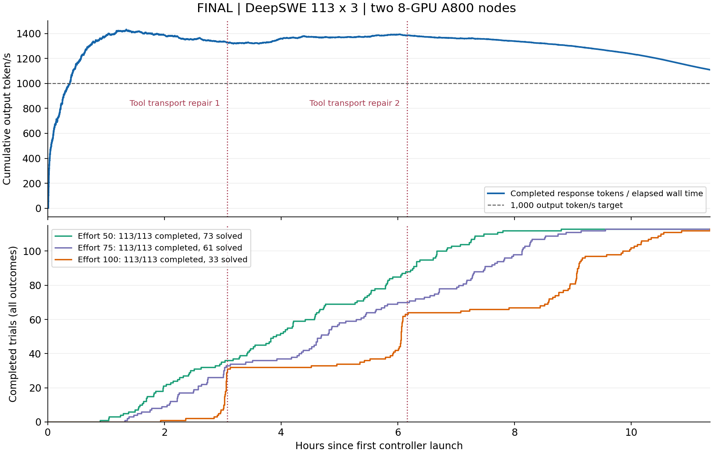

# Complete two-node DeepSWE comparison

Completed on 2026-09-13 using **two nodes, each with eight A800-SXM4-80GB GPUs**. All 113 Datacurve DeepSWE tasks at commit `0b9fabbb63b9104d678fe965e1632f2dd9eaa2ea` were attempted once at each numeric reasoning effort 50, 75, and 100. The agent was mini-SWE-agent 2.4.6 with frozen local source. This is a separate benchmark from SWE-bench Verified 500.

| Effort | Strict tasks passed | Output tokens, including reasoning | Reasoning tokens | Complete model replies | Mean replies/task | Generated tool calls | Group wall hours |
|---|---:|---:|---:|---:|---:|---:|---:|
| 50 | 73/113 (64.60%) | 11,242,184 | 8,223,366 | 14,274 | 126.32 | 14,351 | 8.797 |
| 75 | 61/113 (53.98%) | 14,613,625 | 11,148,481 | 15,818 | 139.98 | 16,033 | 9.557 |
| 100 | 33/113 (29.20%) | 19,469,477 | 15,438,521 | 17,020 | 150.62 | 17,685 | 11.356 |

**Complete aggregate throughput: 45,325,286 output tokens / 40,882.45 seconds = 1,108.67 tokens/s.** The denominator covers first controller start through last controller exit, including tools, scoring, failures, and the tail. Only completed benchmark response usage is credited; other clients' output is excluded. This is aggregate two-node throughput, not single-request decode speed. There is no matched single-node DeepSWE run or routing-policy ablation establishing a scaling factor or optimal throughput.

The top curve is cumulative output divided by elapsed wall time. Completed trials in the lower panel include test failures and execution errors. Both tool-transport repair times are marked. The exported [timeline data](evidence/deepswe-timeline.json) is sampled by minute; the PNG uses every complete response.

## Protocol and budget effects

Each effort ran 32 concurrent tasks, simultaneously across the shared two-node service, with identical task order seed 20260912. Sampling used temperature 1, top-p 0.95, top-k 20, at most 32,768 output tokens per response, and 500 agent steps. Each agent had an outer 10,800-second limit and inner 10,700-second limit. Verifiers had 1,800 seconds. Tool containers used 8 GiB host RAM and no network; the model client ran outside them.

Task images were pinned by digest, exact base revisions verified, and the standard mini-SWE observation template retained the first and last 5,000 characters when output exceeded 10,000. Official scoring used only committed base-to-HEAD patches. Uncommitted working-tree patches were retained for audit and never substituted into scores. All controllers exited zero and 1,336 frozen source/configuration hashes passed validation. The separate Docker CLI compatibility layer was repaired twice during the run, as disclosed below.

| Effort | Tasks exhausting agent time budget | Of these, no committed patch | Client prefix hit ratio | TTFT median / P95 (s) |
|---|---:|---:|---:|---:|
| 50 | 5 | 4 | 96.05% | 1.273 / 10.262 |
| 75 | 21 | 20 | 96.45% | 1.352 / 9.106 |
| 100 | 69 | 66 | 97.33% | 1.424 / 5.471 |

High effort frequently ran out of time before committing a patch. These results measure performance under this budget and shared-load protocol; they do not establish that maximum effort has lower capability with adequate resources. Each task/effort has only one stochastic attempt. Changing external load and the mid-run repairs also limit causal comparisons. TTFT includes queueing, prefill, first decode and streaming; it is not isolated prefill time.

Paired outcomes: 50→75 gained 10 and lost 22 tasks; 75→100 gained 3 and lost 31; 50→100 gained 5 and lost 45. All failures remain in the 113-task denominator. No agents were rerun. An earlier configuration-invalid run was excluded in its entirety before this run began.

## Inference and routing

Each node used TP4 × DP2, EP8, DSpark5, `FULL_DECODE_ONLY` CUDA Graphs, FP8 sparse MLA KV, GPU prefix caching, Engram CPU offload, 64 sequences per DP, 8,192-token prefill chunks and a 524,288-token context limit. Node A allocated 85% of GPU memory; node B allocated 90%, increasing KV capacity from 6,219,084 to 7,791,013 tokens per DP (+25.3%). The complete evaluation recorded zero KV preemptions. LMCache was disabled because its separate natural-output replays did not demonstrate a throughput benefit.

The [backend-metrics router](../router/README.md) used actual per-DP running/waiting requests, KV pressure and generation counters, including requests bypassing the router. Reservations covered delayed metrics, stale backends received no new requests, and session affinity preserved cache reuse unless load warranted migration. All four workers served benchmark traffic. This policy observes competing inference traffic directly and changes generation capacity estimates as service rates change; it does not reserve hardware against arbitrary GPU processes or dynamically resize a running server's memory allocation.

## Accounting and execution errors

The client and router agreed on input, output, cache and reasoning usage for all 47,112 complete responses. Independent client journals recovered 11 complete replies containing 11,111 output tokens that had not reached saved trajectories before a later failure. Total generated tool calls were 48,069; that is not a count of all actually executed commands.

There were 47,215 HTTP attempts: 47,112 complete responses, 70 HTTP 500 responses, two HTTP 400 responses, and 31 streams without complete final usage. Every HTTP 500 recovered on the next transport attempt. Unreported tokens from partial streams were not estimated. One context-limited query made both HTTP 400 requests under the same request ID after the frozen adapter reduced its output budget; neither returned usage.

| Effort | Recorded outer exception types |
|---|---|
| 50 | 2 AgentTimeoutError, 1 VerifierTimeoutError, 1 RuntimeError |
| 75 | 7 AgentTimeoutError, 1 RuntimeError |
| 100 | 27 AgentTimeoutError, 5 RuntimeError, 1 EOFError |

Outer timeout errors overlap the budget counts above. The effort-100 Scriggo trajectory recorded a context limit at query 430 and its outer Pipe recorded EOFError; these describe one task. The effort-50 pwntools verifier exceeded its 1,800-second budget.

Two Docker CLI tool-transport changes applied to all effort groups without restarting agents:

1. At 3.080 hours, the detached capture wrapper moved into a script file. Actual Valibot and LangChain commands using `pkill -f` had matched the wrapper's inline command text and killed its status writer, causing missing-status timeouts. The failure and repair were reproduced through the real adapter; six integration checks passed.
2. At 6.158 hours, single-file temporary storage replaced recursive temporary-directory cleanup. The first repair's cleanup raised `Cannot call rmtree on a symbolic link`, interrupting effort-50 Testem and effort-100 Obsidian tasks. The exact filesystem trigger remains unresolved. Six real adapter checks passed after removing this cleanup path.

Original failures were retained, including the two caused by the first repair. Some earlier container/status failures lacked complete last-command evidence and have no established cause. A documented Happy DOM host-container OOM was separate from GPU memory: the agent received the killed-process output and continued. Exit code 137 alone was not treated as proof of OOM.

The scored rank proxies retained 15-second keep-alive. The packaged 2-second setting subsequently passed separate real HTTP checks without inference; it was not substituted into this run. See the [transport evidence](evidence/transport-keepalive.json). No complete scored run with that setting or full Docker image build has been validated.

## Evidence

- [Aggregate results, protocol and accounting](evidence/deepswe-final.json)
- [All 339 per-task outcomes and completed client usage](evidence/deepswe-tasks.json)
- [Timeline data](evidence/deepswe-timeline.json)
- [Export and source artifact hashes](evidence/deepswe-evidence-manifest.json)
- [90% memory capacity checks](evidence/capacity90.json)

The public export contains selected results, public dataset task names and artifact hashes. It omits raw prompts, tool commands, internal host paths, addresses and credentials. The full internal evaluation harness is not packaged here; this repository contains the inference deployment kit and redacted evaluation evidence. SM80 metadata fusion and denser graph buckets remain unmeasured candidates and are not credited with these results.
